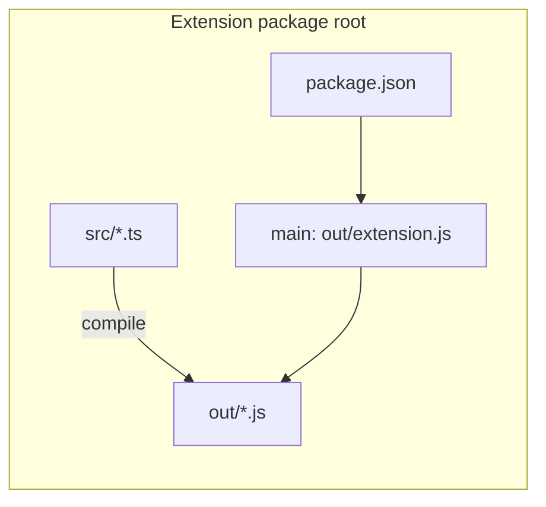
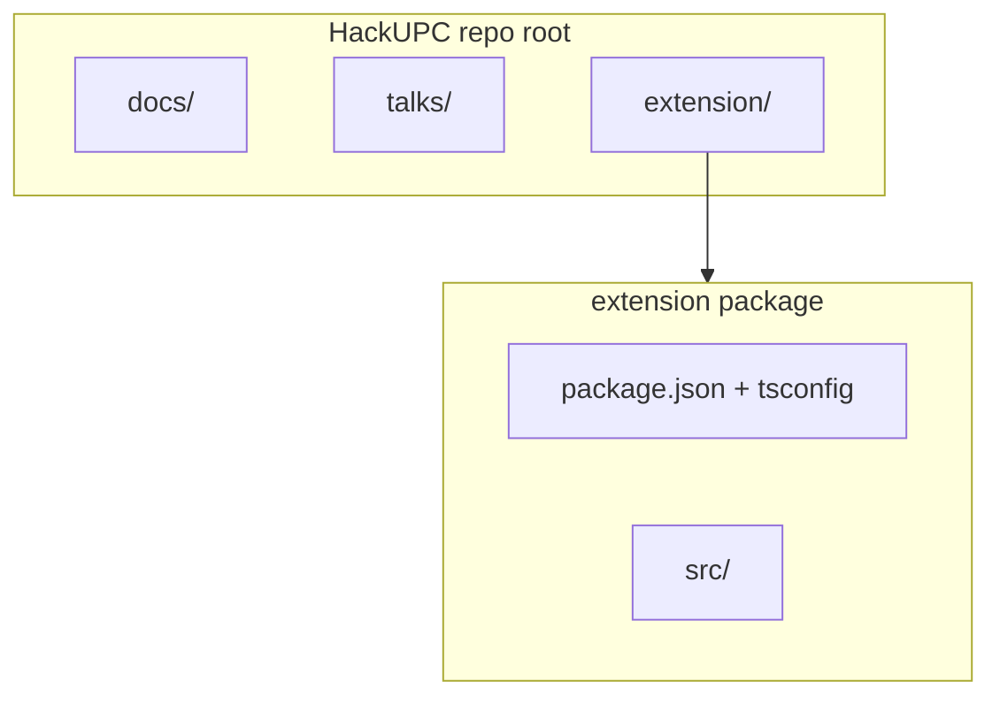

# VS Code extension structure vs this project layout

## What a VS Code extension must have (non-negotiable)

The runtime only cares that the folder you install or load is a **valid extension package**:

1. **[`package.json` extension manifest](https://code.visualstudio.com/api/references/extension-manifest)** at the **root of the extension package** (the folder `code --install-extension` or “Install from VSIX” points at, or the path in multi-root workspaces).
   - **`name`**, **`publisher`**, **`version`**, **`engines.vscode`** (minimum VS Code / Cursor compatibility range).
   - **`main`**: path to the **compiled** JavaScript entry (e.g. `./out/extension.js` or a single bundled `./dist/extension.js`). Cursor loads this file in the Extension Host.
   - **`activationEvents`**: when the host loads your code (e.g. `onStartupFinished`, `onView:yourViewId`, `onCommand:...`). Must match what you actually use to avoid loading too early or not at all.
   - **`contributes`**: commands, views, menus, configuration, etc. — this is how the UI registers with the workbench.

2. **Entry module** (the file `main` points to) that calls `vscode` APIs and registers disposables (commands, tree providers, etc.). Typically one thin `activate(context)` and optional `deactivate()`.

3. **Shippable artifacts**: whatever `main` references must exist in the published VSIX. For TypeScript, that means a **build step** (`out/` or `dist/`) and usually [`.vscodeignore`](https://code.visualstudio.com/api/working-with-extensions/publishing-extension#ignore-files) so `src/`, `node_modules` dev deps, and tests are not bundled incorrectly.

There is **no single official folder naming** for `src/` — the community default is `src/extension.ts` + `out/` from `tsc`, or `src/` + `esbuild`/`webpack` to `dist/`. Yeoman `generator-code` is the usual scaffold.

## What is recommended but not “mandatory”

- **`tsconfig.json`** + TypeScript types `@types/vscode` (pinned to `engines.vscode`).
- **`.vscode/launch.json`** + **`tasks.json`** in the extension folder for F5 “Run Extension” and “Extension Tests”.
- **`README.md`** at extension root for marketplace / local install instructions.
- **Tests**: `src/test/suite` pattern from the official scaffold if you add integration tests.

## What this HackUPC repo should look like

Your [docs/ide_plan_execution_1.plan.md](docs/ide_plan_execution_1.plan.md) already specifies a **greenfield layout**: keep the **extension as its own package** under **`extension/`** at the repo root, with internal modules matching product boundaries:

| Area | Suggested path under `extension/` |
|------|-----------------------------------|
| Activation / wiring | `src/extension.ts` |
| Plan JSON load/save/validate | `src/plan/*` |
| Sidebar tree | `src/ui/planTreeProvider.ts` (and small helpers if needed) |
| Cursor native handoff | `src/dispatch/cursorNativeHandoff.ts`, `src/dispatch/router.ts` |
| Optional SDK/CLI/Claude | `src/dispatch/cursorSdk.ts`, `cursorCli.ts`, `claudeCode.ts` |
| Git resolution | `src/git/resolver.ts` |

At **repo root** (outside `extension/`), you can keep existing **docs-first** material — [docs/base_idea.md](docs/base_idea.md), [docs/ide_plan_execution_1.plan.md](docs/ide_plan_execution_1.plan.md), `talks/`, etc. The only “must” at repo root for the extension is **none** unless you add a root `README` that points to `extension/` for developers.

## Optional later choices (not required for v1)

- **Monorepo tooling** (`pnpm-workspace.yaml`, Nx, Turborepo) if you add a second package (e.g. a shared JSON schema npm package). Not needed on day one.
- **Single-package repo**: some teams use the repo root as the extension root only; that would **not** match your current docs-heavy repo unless you move docs elsewhere — keeping **`extension/`** as the package root is the better fit here.

## Summary

- **Must follow**: valid `package.json` + compiled `main` entry + matching `activationEvents` / `contributes` + build output that ships with the VSIX.
- **This project**: keep documentation at repo root; implement the product under [`extension/`](extension/) exactly as your plan’s “Repo layout” section describes, with `src/extension.ts` as the conventional activation entry and the planned `src/plan`, `src/ui`, `src/dispatch`, `src/git` split.
