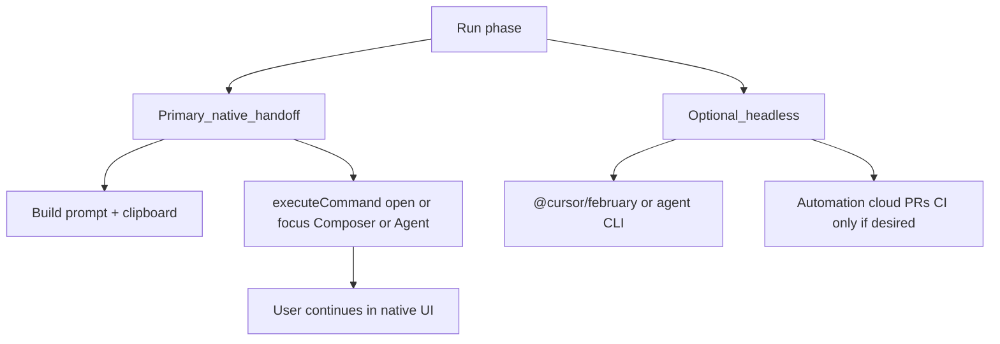
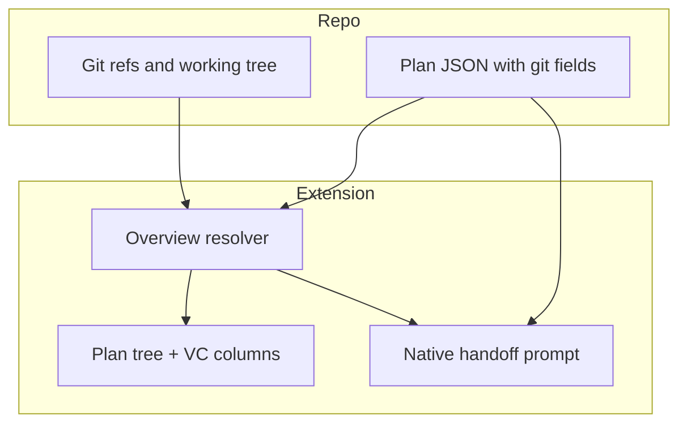
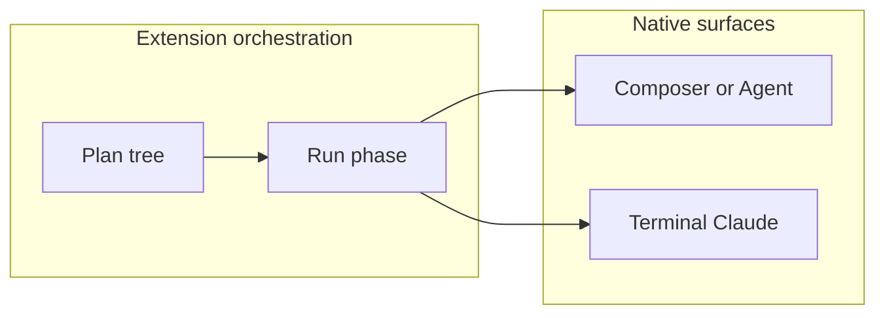

# IDE extension: partial plan execution for agents

## Scope

- **IDE**: VS Code extension API only — runs inside **Cursor** as the primary environment. **JetBrains is out of scope.**

## Product boundary (non-goals vs goals)

| In scope (this extension) | Out of scope |
|---------------------------|--------------|
| **Idea → plan structure**: many plans, phases, dependencies, status, “run **this** phase only”. | **Re-implementing code editing**: custom diff UIs, file edit streams, or replacing Composer’s accept/reject loop. |
| **Handoff**: one action that starts the **native** agent session with the right prompt and context. | Making the **editing** experience “better” — that stays Cursor’s (or Claude Code’s) product surface. |

**Principle:** the extension fills the gap **from structured intent to the start of execution**; **file changes** should look and feel **as close as possible to today’s native agent** (Composer / agent mode, familiar tool cards, inline diffs). Orchestration UI stays thin: tree, badges, run phase, blockers—not a second editor.

## Product goal (button → native execution)

**Run phase** should land the user (or the session) in the **same editing experience** they already use for agentic work, with the phase prompt already in play—**not** a bespoke “watch the extension webview while the repo changes” flow for normal development.

## Cursor dispatch (priority reordered for native editing)

| Path | Role |
|------|------|
| **Native handoff (default)** | Put the constructed phase prompt on the **clipboard** (and/or any future supported injection), run `executeCommand` to **open or focus** Composer / Agent / chat. User presses send or pastes once if needed. **All subsequent tool use and edits** happen in Cursor’s native surfaces. Spike and maintain **command ID overrides** in settings when Cursor changes internals. |
| **SDK / CLI (optional)** | [`@cursor/february`](https://cursor.com/docs/api/sdk/typescript) or [`agent` CLI](https://cursor.com/docs/cli/headless) for **headless**, **cloud**, **CI**, or demos where showing native UI is secondary. **Not** the default story for “I’m coding in the IDE and want the usual agent edit loop.” |

### Why this deprioritizes SDK-as-default for in-IDE coding

The SDK can run a real agent against `local.cwd`, but streaming into an **OutputChannel** centers progress in the extension—not in Composer. That diverges from “as similar as possible to the native experience” for **editing**. Keep the SDK as an **advanced setting**, not the default handoff for interactive code phases.

**Claude Code:** prefer **integrated terminal** + `claude` so the user stays in the familiar CLI/tty flow for that stack—still no custom extension diff viewer.

## Data model (align with product docs)

- **Plan file** (e.g. `.planstack/plans/<id>.json`): `id`, `title`, `phases[]` with `id`, `title`, `body`, `status`, optional `dependsOn`.
- **Run phase** builds one prompt: plan title + phase `body` + explicit “only this phase” instruction—**payload for the native agent**, not a second execution engine by default.

### Git and version control (plans ↔ branches ↔ overview)

**Goal:** give a **single orchestration picture** of “what work is tied to which line of Git history” without building a second code review product. Editing and merges stay in Git UI / host (GitHub, etc.); the extension answers “which branch belongs to which plan/phase?” and “is the tree clean / how far from main?”

**Metadata in plan files (suggested fields, v1):**

| Field | Level | Purpose |
|--------|--------|---------|
| `git.baseBranch` | plan | Default integration target (e.g. `main`) for comparisons and “ahead/behind”. |
| `git.planBranch` | plan (optional) | Default **work branch** for every phase that does not set its own. |
| `git.phaseBranch` | phase (optional) | **Per-phase override** only: use this branch for this phase instead of `git.planBranch`. |
| `git.branchPattern` | plan (optional, deferred) | Template for generated names — omit from parsers until supported; keep separate from `planBranch` / `phaseBranch`. |

**Normative branch resolution:** `effectiveWorkBranch(phase) := phase.git.phaseBranch ?? plan.git.planBranch ?? null`. Do not use a single field name `git.branch` at two hierarchy levels (flattening or partial JSON is ambiguous).

**Conventions (document, don’t over-enforce):** encourage predictable names (`planstack/<plan-slug>`, or `feature/<ticket>-<phase>`) so `git branch -a` and PR titles stay readable. Teams can adopt stricter rules in their own CONTRIBUTING.

**Extension behaviour (read-first, small writes):**

1. **Resolve state** — On refresh (and on window focus), resolve **`effectiveWorkBranch(phase)`** against the repo: exists? checked out? **ahead/behind** vs `git.baseBranch`? **working tree dirty**? Use the built-in **`vscode.git` extension API** when available, else `git` via `child_process` with safe argument lists.
2. **Overview UI** — A second view or columns on the plan tree: **Branch**, **Status** (e.g. clean / dirty / gone / not created), **↑/↓ vs base** (counts or icons). This is the “general overview” for orchestration—not a full graph of every commit.
3. **Actions (optional v1)** — Commands such as **“Create branch from pattern and checkout”**, **“Checkout plan branch”**, **“Open diff vs base”** (delegate to VS Code’s native diff/compare). Optionally append branch name + base to the **handoff prompt** so the native agent knows where to work.
4. **Handoff prompt enrichment** — When **`effectiveWorkBranch(phase)`** is non-null, include in the clipboard payload: current checkout branch, that effective work branch, and `git.baseBranch` so Composer aligns with the same VC story the sidebar shows.

**Out of scope here:** auto-merge, conflict resolution UI, or replacing Git hosting PR flows—only **linking, visibility, and light branch helpers**.

## Settings (user-visible)

- `planstack.cursor.handoff`: `native-first` (default) | `sdk-local` | `sdk-cloud` | `cli` — document that **native-first** matches the product boundary above.
- Command ID overrides for focus/open native UI.
- API key / SDK only required when a non-native mode is selected.

## UX (minimal viable)

1. Sidebar: plans → phases → status (orchestration only).
2. **Run phase (default)**: toast like “Prompt copied — Composer focused” (exact copy depends on spike); **no** primary UX that relocates editing into the extension.
3. Optional **light** log channel only for debugging handoff or headless modes—not a substitute for Composer.

## Repo layout (greenfield)

- `extension/` — `src/dispatch/cursorNativeHandoff.ts` (clipboard + executeCommand), `src/dispatch/router.ts`, optional `src/dispatch/cursorSdk.ts`, `src/dispatch/cursorCli.ts`, `src/dispatch/claudeCode.ts`, `src/plan/*`, `src/git/resolver.ts`, `src/ui/planTreeProvider.ts`

## Risks and mitigations

- **Native handoff is imperfect** (paste step, fragile command IDs) → document workarounds; optional modes for power users.
- **Do not creep scope** into rich in-extension review UI—that contradicts the boundary above.

## Out of scope

- JetBrains; collaboration graph; **any first-class “edit code inside the extension” UX** — see [base_idea.md](base_idea.md).